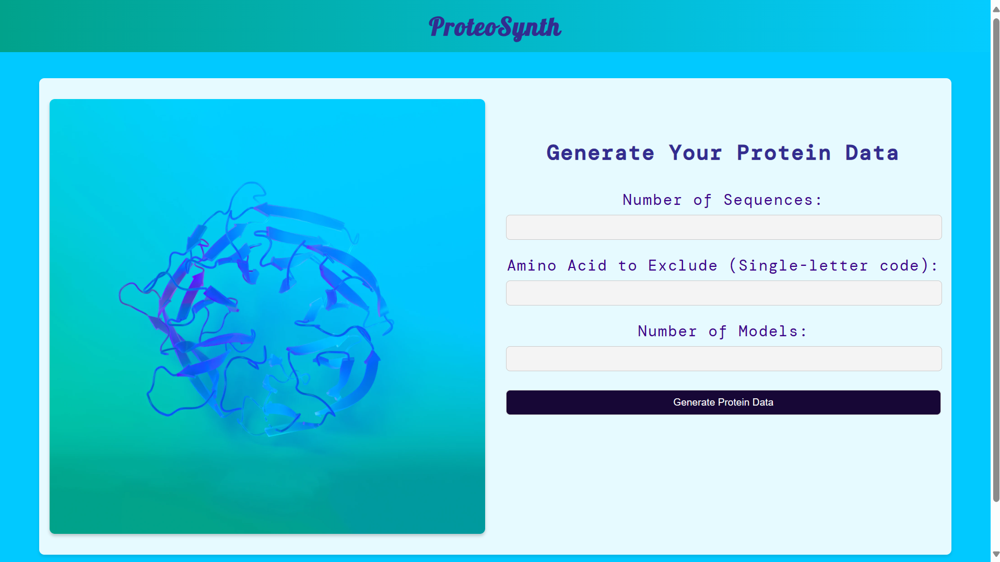

# ProteoSynth

## About the repo
...

## How to Use
...



## How to install

1.  Install from this repo as:

```
git clone https://github.com/Pushkar1853/ProteoSynth.git 
```

2.  Create a virtual environment  

```
python3 -m venv env 
source env/bin/activate
```

3.  To Run this flask app:

```
python3 app.py
```

## Requirements:

1.  Packages:
* Flask == 3.0.3
* Pip == 22.0.2
* python == 3.10.12

2.  System Requirements:
* Ubuntu == 22.04 (version)
  
  ```
  (Linux OS preferably,  
  for Windows -> use WSL
  for MAC -> use VirtualBox)
  ```
